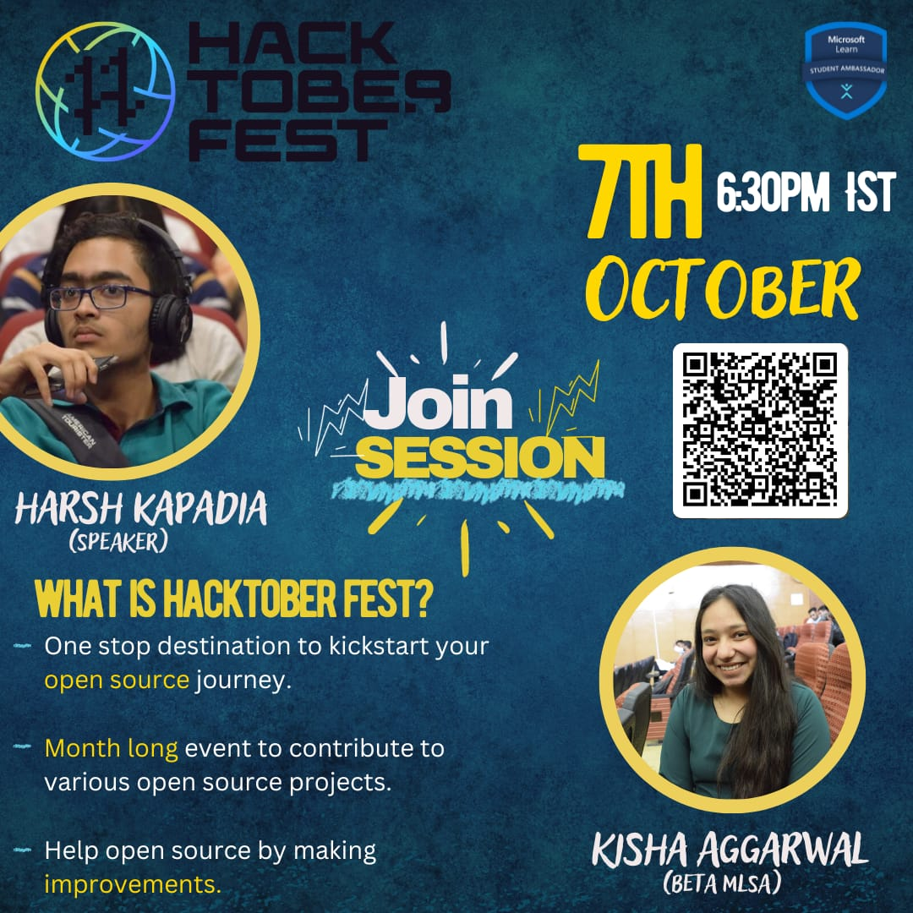

# Hacktoberfest 2023 College Event

Welcome to the [Hacktoberfest 2023](https://hacktoberfest.com/) College Event repository! In this README, we'll provide an overview of the event, its purpose, and the topics that will be covered during the talks.

## Why is the Event Being Conducted?

- **Purpose**: The event is being conducted to promote open source and raise awareness about the importance of contributing to open source projects. It aims to educate and inspire students to get involved in the world of open source software.

## Topics Covered in Talks

### 1. What is Open Source?

- **Definition**: Open source refers to software that is released with a license that allows anyone to view, use, modify, and distribute the source code. It fosters collaboration and transparency in software development.

### 2. Why Should You Care About It?

- **Benefits**: Understanding and contributing to open source can enhance your programming skills, build a portfolio, and be a part of a global community of developers.

### 3. Why Open Source?

- **Importance**: Open source software drives innovation, reduces software costs, and empowers individuals and organizations to customize and improve their tools.

### 4. Spirit of Open Source

- **Principles**: The spirit of open source is built on collaboration, transparency, and a commitment to the greater good of the community. It's about giving and sharing.

### 5. What is Hacktoberfest?

- **Definition**: Hacktoberfest is an annual event hosted by DigitalOcean and GitHub that encourages contributions to open source projects during the month of October.

### 6. Why is it Held?

- **Purpose**: Hacktoberfest is held to celebrate and support the open source community, encourage contributions, and reward participants with limited-edition swag.

### 7. What It Is Not About

- **Misconceptions**: Hacktoberfest is not about spamming repositories with low-quality contributions. It's about meaningful contributions that add value to open source projects.

### 8. Rules of HacktoberFest 2023

- **Rules**: [Participation Rules](https://hacktoberfest.com/participation/)

## Join Us!

We invite you to join us for this exciting event to learn, collaborate, and celebrate open source. Together, we can make a positive impact on the world of software development.

Stay tuned for event updates and speaker details. We look forward to seeing you at Hacktoberfest 2023!
